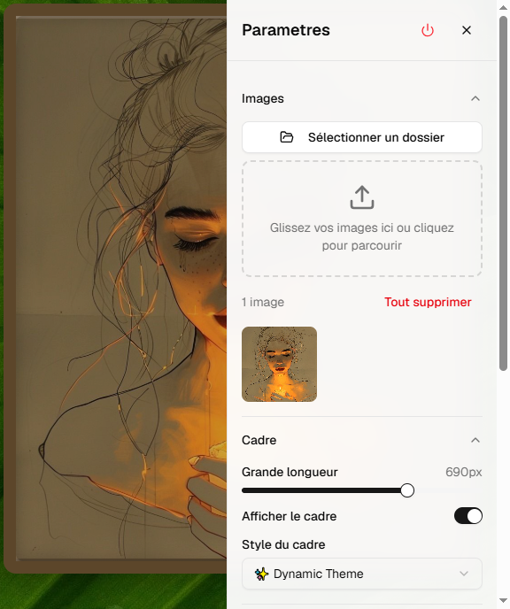

# 🖼️ Photo Frame – Cadre photo numérique pour Windows

**Photo Frame** est une application gratuite qui transforme votre écran en un cadre photo élégant. Affichez vos images en mode unique ou en diaporama, avec des effets de cadre et des réglages personnalisables.

---

## ✨ Fonctionnalités

- **Chargement facile** : import d’images, glisser‑déposer, ou sélection d’un dossier complet.
- **Deux modes** : image unique ou diaporama.
- **Diaporama** : intervalle réglable (1 à 60 s), ordre aléatoire, navigation manuelle.
- **Effets cadre** : activation, taille ajustable, nombreux styles (classiques, artistiques, rétro, innovation).
- **Thème dynamique** : style basé sur la couleur dominante de l’image.
- **Effet Rain Glass** : animation de pluie générée par canvas.
- **Opacité réglable** : de 10% à 100%.
- **Sauvegarde** : tous vos réglages sont conservés d’une session à l’autre.
- **Fenêtre sans bordure** : expérience immersive.

---

## 📥 Téléchargement et installation

1. Téléchargez le fichier **`Photo Frame Setup 0.1.0.exe`** (disponible dans ce dépôt).
2. Double‑cliquez sur l’installateur.
3. Suivez les instructions à l’écran.

> ⚠️ Windows peut afficher un avertissement « Windows a protégé votre PC ». Cliquez sur **Plus d’infos** puis **Exécuter quand même**. L’application est totalement sûre.

---

## 🖼️ Formats d’image supportés

`.jpg` – `.jpeg` – `.png` – `.gif` – `.webp` – `.bmp`

---

## 💖 Soutenir le projet

Photo Frame est **gratuit**. Si vous l’appréciez, vous pouvez m’offrir un café (ou plusieurs ☕) sur Ko‑fi :

Merci pour votre soutien !

---

## 📦 Version

v0.1.0 – Dernière mise à jour : mai 2026

## 🖼️ Aperçu

